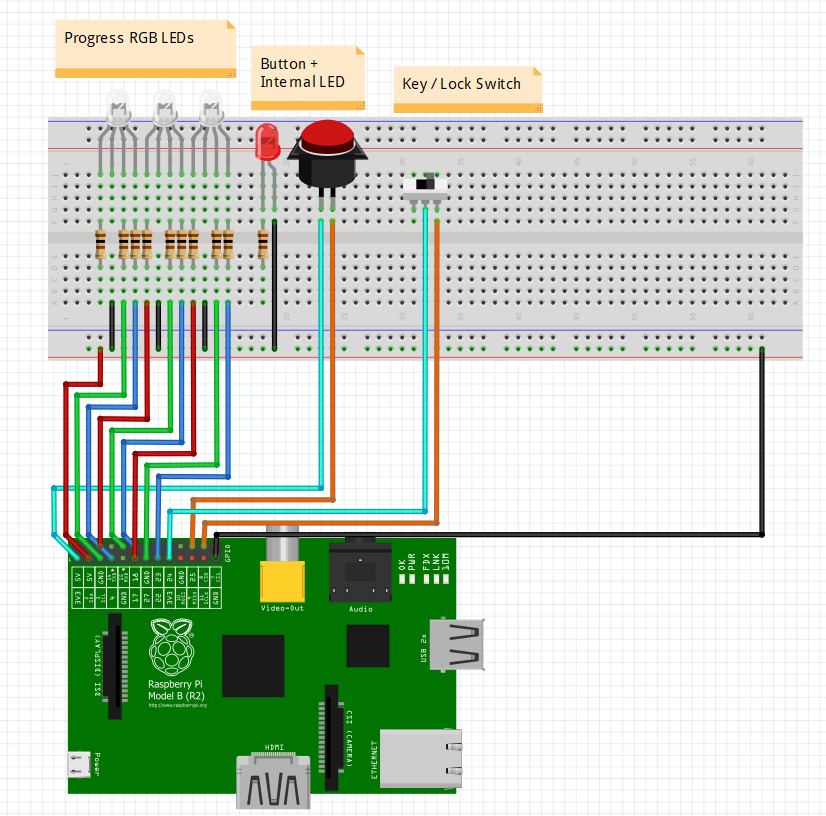

# Deploy Away

A project involving DeployHQ, a Raspberry Pi, and a big red button.

The project aims to make manual deployments a little more special by hooking physical components to virtual actions.

A user uses a key to turn the lock switch, which "arms" the deploy button. While armed, the user can press the button
which triggers a deployment of the latest revision of a configured branch (see config below).

While deploying, 3 LEDs are utilised to show progress in semi real time (by polling).

After the deployment is completed, the button can be re-armed for deployment again. 

## Components

 

(TODO: Loop / state diagram).

### Physical

* Raspberry Pi (ye olde 26 pin GPIO) with a WiFi dongle.
* 3 RGB LEDs.
* 9x 100 ohm resistors.
* A big red button (with internal LED).
* A key switch.

### Software

* Raspbian OS
* PHP 7 (with Composer)

### Main PHP Packages

* Auryn - Next-level dependency injector.
    * Saved a ton of time while swapping out components during testing.
    * It's just so cool.
* PHPi - Non-blocking pi GPIO pin control library.
    * Uses React for that sweet sweet asynchronicity.
    * Abstractions made stubbing super easy when testing without the Pi.
* Amp - Non-blocking concurrency framework for PHP.
    * Turns callback hell into generator heaven.
    * `yield` All the things!
* Artax - HTTP client component for Amp.
    * Enables non blocking HTTP requests to third party services.
    * Who needs SDKs anyway?
* ReactAdapter - Amp's answer to working with React's `LoopInterface`.

### External Services

* DeployHQ - Service which enables deploying code to servers.
